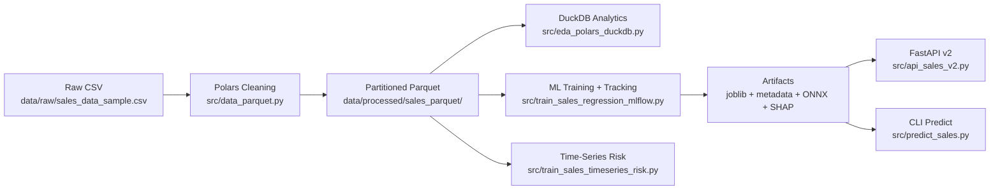

# 📊 Sales Analytics & ML — From One CSV to a Mini MLOps Pipeline (DVC + MLflow + FastAPI + ONNX + TS Risk)

Turn a messy **sales CSV** into a **reproducible analytics + machine learning pipeline** that looks and feels like real production work:
data cleaning → Parquet data layer → SQL analytics → model training & experiment tracking → explainability → export → API serving → time‑series forecasting & volatility (risk).

> **Resume story (1 sentence):**  
> *“I took a raw sales export and built a production‑style pipeline with DVC reproducibility, MLflow experiments, a best‑model artifact set (joblib + ONNX + metadata), SHAP explainability, an online FastAPI predictor, and a time‑series risk module (SARIMA + GARCH) for a selected segment.”*

---

## ✅ What this repo proves (skills that show up in interviews)

**Data Engineering**

- Polars ingestion + cleaning
- Partitioned **Parquet** as a canonical processed layer
- **DuckDB** analytics on Parquet (SQL without managing a DB server)

**ML Engineering**

- scikit‑learn **Pipeline + ColumnTransformer**
- model benchmarking (Linear / RF / GBT / XGBoost / LightGBM / CatBoost)
- consistent training ↔ inference schema (CLI + API reuse the same feature set)
- model artifacts: `joblib` + `metadata.json` + `ONNX`

**MLOps / Reproducibility**

- **DVC pipeline**: deterministic stages, tracked dependencies/outputs, tracked metrics
- **MLflow** tracking: params, metrics, artifacts, run comparison
- logging utilities + config‑driven execution

**Time‑Series & Risk**

- SARIMA forecasting with baseline comparison
- GARCH(1,1) volatility estimation on monthly returns

---

## 🧩 Two evolutions: v1 vs v2

This repo keeps two versions side‑by‑side so you can show progression:

- **v1**: script‑style, config‑driven EDA + classic regression + basic monitoring + Streamlit + FastAPI (quick prototype).
- **v2 (main focus)**: “mini MLOps” architecture: Polars → Parquet → DuckDB → MLflow training + SHAP + ONNX + FastAPI v2 + CLI + time‑series risk.

➡️ **Details**

- `v1/README.md` — v1 implementation notes  
- `v2/README.md` — v2 architecture, modules, and deeper docs

---

## 🔗 Dataset

- **Source**: Kaggle — *Sample Sales Data* (`sales_data_sample.csv`)
- **Target (regression)**: `SALES` (continuous)
- **Note**: raw CSV is **not committed** (Kaggle terms).

Download and place it here (v2 path):

```text
data/raw/sales_data_sample.csv
```

---

## 🏗️ Architecture (high‑level)



---

## 🧠 Interview script (the exact story to tell)

### 1) What problem were you solving?

A business exports sales data as a CSV. You need to **clean it**, **analyze it**, **train a model** to predict order‑level sales, and make the pipeline **repeatable and deployable**.

### 2) What technologies did you try and why did you pick this stack?

- **Polars**: faster CSV ingestion + transformations than pandas for this workload; predictable behavior on messy exports.
- **Parquet**: compressed, columnar, great for repeated analytics/training.
- **DuckDB**: SQL analytics directly on Parquet files (no server, no ops burden).
- **scikit‑learn Pipelines**: safe preprocessing + consistent transformations in training/inference.
- **MLflow**: experiment tracking to compare models and keep artifacts organized.
- **SHAP**: explain tree models; show feature drivers to stakeholders.
- **ONNX**: portable export for non‑Python runtimes.
- **FastAPI**: typed, production‑friendly serving.
- **DVC**: reproducibility and “pipeline as code” with tracked metrics and artifacts.
- **SARIMA + GARCH**: forecasting + volatility insight for a segment (Classic Cars, USA).

### 3) What metrics did you track?

**Regression**

- RMSE (main optimization metric)
- MAE (robustness / interpretability)
- R² (variance explained)

**Time‑Series (SARIMA)**

- RMSE, MAE on a test window
- MAPE / sMAPE (with safe handling for zeros)
- improvement vs **naive baseline** (last observed value)

**Risk (GARCH)**

- volatility estimates (monthly + annualized)
- forward variance forecast horizon

### 4) What problems did you hit and how did you solve them?

- **CSV encoding & date parsing**: add safe fallbacks + logging; enforce a clean date pipeline before downstream stages.
- **Schema consistency**: centralize features; store schema/feature list in `models/sales_regressor_metadata.json`.
- **Leakage risk**: engineered features are derived strictly from inputs (e.g., quantity × price), not from `SALES`.
- **ONNX export dtype issues**: enforce numeric casts and patch ONNX input types for stable conversion.
- **Time series zeros + short history**: use sMAPE and guardrails; return clear error details in JSON instead of silent failure.

---

## 🔁 Reproducibility with DVC (pipeline you can trust)

This project uses **DVC stages** to make every run repeatable and auditable. The pipeline is declared in `dvc.yaml` and tracks:

- dependencies (`deps`)
- outputs (`outs`)
- metrics files (`metrics`)

### DVC stages

```yaml
stages:
  data_to_parquet:
    cmd: python -m src.data_parquet
    deps:
      - config_v2.yaml
      - src/config_v2.py
      - src/data_parquet.py
      - src/logging_utils.py
      - data/raw/sales_data_sample.csv
    outs:
      - data/processed/sales_parquet

  train_regression:
    cmd: python -m src.train_sales_regression_mlflow
    deps:
      - config_v2.yaml
      - src/config_v2.py
      - src/train_sales_regression_mlflow.py
      - src/logging_utils.py
      - src/sales_regression
      - data/processed/sales_parquet
    outs:
      - models/sales_regressor.joblib
      - models/sales_regressor_metadata.json
      - models/sales_regressor.onnx
      - output/explainability
    metrics:
      - output/metrics/sales_regression_metrics.json

  train_timeseries_risk:
    cmd: >
      python -m src.train_sales_timeseries_risk
      --product-line "Classic Cars"
      --country "USA"
      --forecast-steps 6
      --garch-horizon 6
    deps:
      - config_v2.yaml
      - src/config_v2.py
      - src/train_sales_timeseries_risk.py
      - src/logging_utils.py
      - data/processed/sales_parquet
    metrics:
      - output/timeseries/sales_ts_risk_classic_cars_usa.json
```

### Running the full pipeline

```bash
# run all stages end-to-end
dvc repro

# visualize the pipeline graph
dvc dag

# compare metrics across versions/branches
dvc metrics show
dvc metrics diff
```

---

## ⚙️ Quickstart (v2)

### 1) Create venv and install

```bash
python -m venv .venv
source .venv/bin/activate  # Windows: .venv\Scripts\activate
pip install -e .
```

### 2) Install DVC (if needed)

```bash
pip install dvc
```

### 3) Place the dataset

```text
data/raw/sales_data_sample.csv
```

### 4) Run the pipeline (recommended)

```bash
dvc repro
```

After this, you should have:

- Parquet layer: `data/processed/sales_parquet/`
- Best model + metadata + ONNX:
  - `models/sales_regressor.joblib`
  - `models/sales_regressor_metadata.json`
  - `models/sales_regressor.onnx`
- Regression metrics JSON:
  - `output/metrics/sales_regression_metrics.json`
- SHAP explainability artifacts:
  - `output/explainability/`
- Time‑series risk report JSON:
  - `output/timeseries/sales_ts_risk_classic_cars_usa.json`

---

## 🧪 Experiment tracking (MLflow)

Training logs all runs to a local MLflow store (`mlruns/`). You can open the UI:

```bash
mlflow ui --backend-store-uri file:mlruns
```

What you’ll see:

- one run per model spec (RF/GBT/XGB/LGBM/CatBoost/etc.)
- metrics (RMSE/MAE/R²)
- artifacts (trained pipeline, input example, SHAP report, etc.)

---

## 🌐 Serving (FastAPI v2)

Start the API after training (or after `dvc repro`):

```bash
uvicorn src.api_sales_v2:app --reload
```

Endpoints:

- `GET /health` — model status + metadata (feature list, run id)
- `POST /predict` — predict `SALES` for one order line

---

## 🧰 Offline inference (CLI)

```bash
python -m src.predict_sales --show-schema

python -m src.predict_sales --json '{
  "QUANTITYORDERED": 30,
  "PRICEEACH": 95.7,
  "ORDERLINENUMBER": 3,
  "MSRP": 120.0,
  "QTR_ID": 3,
  "MONTH_ID": 7,
  "YEAR_ID": 2004,
  "PRODUCTLINE": "Classic Cars",
  "COUNTRY": "USA",
  "DEALSIZE": "Medium"
}'
```

---

## 📁 Repo map (important folders)

```text
config_v2.yaml                  # main config (v2)
dvc.yaml                        # reproducible pipeline stages
data/
  raw/                          # raw CSV (not committed)
  processed/                    # partitioned parquet outputs
models/                         # best model artifacts (joblib + metadata + onnx)
output/
  metrics/                      # regression metrics JSON
  explainability/               # SHAP artifacts
  timeseries/                   # SARIMA + GARCH risk reports
mlruns/                         # MLflow local tracking store
src/
  data_parquet.py               # Polars cleaning -> parquet layer
  eda_polars_duckdb.py          # DuckDB analytics on parquet
  train_sales_regression_mlflow.py
  train_sales_timeseries_risk.py
  api_sales_v2.py               # serving
  predict_sales.py              # CLI inference
  sales_regression/             # schema, preprocessing, models, export, explainability, report
```

---

## 🛣️ Next improvements (if you ask “what would you add?”)

- CI (GitHub Actions): lint + tests + `dvc repro --pull` on sample data
- MLflow Model Registry / promotion workflow
- API load testing + structured monitoring (Prometheus metrics)
- Data validation contracts (pandera / pydantic‑based checks) before training
- Drift monitoring automation (scheduled evaluation + alert)

---

## 📜 License

MIT License. See `LICENSE`.
