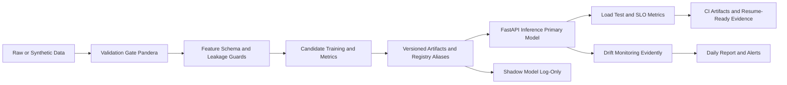

# 🚀 Production-Grade ML Platform Monorepo
**Sales Forecasting Regression (Flagship) + California Housing Template (Reference)**

## 🔑 Key Achievements
- Designed and implemented a **single ML platform architecture** that serves two real regression use-cases with one shared core library.
- Enforced **data contracts and validation gates** before training and before inference using **Pandera**.
- Built **model governance primitives**: versioned artifacts, `staging/prod` aliases, promotion, and rollback.
- Implemented **complete MLflow logging** for Sales training: model, signature, input example, metadata, and report artifacts.
- Added **cross-project DVC orchestration** (`train`, `eda`, `monitor`, `quality`) with CI-ready `dvc repro` and `dvc metrics diff`.
- Added a **reproducible and versioned EDA report generator** for both Sales and California with JSON/Markdown/plot artifacts.
- Implemented **shadow/canary (log-only)** inference to compare candidate models safely in production traffic.
- Added **drift monitoring** with **Evidently** reports + alert artifacts (daily scheduled workflow).
- Added **performance engineering** with Locust load tests and persisted **p95/p99 latency** reports.
- Implemented CI/CD pipeline with **lint -> test -> docker build -> smoke test -> load test**.
- Reached strong reliability baseline with measurable quality signals (`35/35` tests passed, `86.75%` coverage).

## 🎯 Problem Statement
In many teams, each ML use-case starts as an isolated script. This creates duplication, weak reproducibility, and difficult model governance.

This project solves that by establishing a **shared production contract** for:
- data validation and schema safety,
- training/evaluation lifecycle,
- artifact registry and model versioning,
- inference API behavior,
- monitoring and operational reporting.

The result is a **platform approach**, not just a one-off model.

## 🧱 Architecture Overview


## 🛠️ Stack Decisions (What Was Tried, What Was Chosen, Why)

### 1) Data Validation Gate
- Tried: **Great Expectations** and **Pandera**.
- Chosen: **Pandera**.
- Why: code-first schema definitions, lightweight runtime, smooth integration in Python training/serving paths, faster CI feedback loop.

### 2) Data Layer and Analytics
- Tried: pure pandas vs mixed stack with **Polars + DuckDB**.
- Chosen: pandas-first for core train/serve portability, with optional Polars + DuckDB data-layer path for scalable analytical workloads.
- Why: balance between developer speed and analytical scalability.

### 3) Modeling Strategy
- Tried: `LinearRegression`, `RandomForestRegressor`, `GradientBoostingRegressor`.
- Chosen: benchmark multiple candidates, promote best by primary metric (`RMSE`) under common preprocessing and contracts.
- Why: transparent model selection, reproducible comparisons, defensible interview narrative.

### 4) Serving and Contract Consistency
- Tried: per-project API implementations.
- Chosen: shared app factory in `ml_core.serving` with dynamic request models from a single feature schema.
- Why: avoids train/serve contract drift and removes duplicate API infrastructure.

### 5) Registry and Release Control
- Tried: direct artifact overwrite and ad-hoc promotion.
- Chosen: versioned artifacts + alias-based release (`staging`, `prod`) + rollback.
- Why: safe promotion model, auditable releases, and quick recovery path.

### 6) Shadow/Canary Strategy
- Tried: direct canary routing and log-only shadowing.
- Chosen: log-only shadow predictions first.
- Why: zero user impact, low-risk model comparison in real request patterns.

### 7) Drift Monitoring
- Tried: PSI-only custom checks vs full drift report frameworks.
- Chosen: **Evidently** for rich daily drift reporting, plus alert artifact generation.
- Why: standard industrial monitoring artifact format (HTML/JSON) and explainable drift evidence.

### 8) Load Testing
- Tried: k6 and Locust.
- Chosen: **Locust**.
- Why: Python-native test definitions, straightforward CI automation, and structured CSV artifacts for p95/p99 analysis.

## 📊 Metrics and Operational Evidence
All key numbers are persisted and reproducible from generated artifacts.

### Quality Snapshot
Source: `reports/quality/quality_report.json` (generated at `2026-02-15T12:24:22.510010+00:00`)
- Test pass rate: `35/35`
- Coverage: `86.75%` (`825/951` lines)
- Test duration: `14.022s`

### Sales Forecasting (Flagship)
- Best model: `GradientBoostingRegressor`
- RMSE: `262.9941`
- MAE: `202.8622`
- R2: `0.9907`
- Sample prediction: `3695.3860`
- Latency p95 (quality benchmark): `0.8686 ms`
- Calibration error: `42.9567`
- PSI (`PRICEEACH`): `0.0350`

### California Housing (Reference Template)
- Best model: `LinearRegression`
- RMSE: `0.2251`
- MAE: `0.1765`
- R2: `0.9597`
- Sample prediction: `194.1078`
- Latency p95 (quality benchmark): `0.4596 ms`
- Calibration error: `0.0112`
- PSI (`MedInc`): `0.2444`

### Load Test Snapshot (Operational)
Source: `reports/loadtest/summary.json`
- Sales API: `p95=32 ms`, `p99=55 ms`, `failures=0`, `rps=41.52`
- California API: `p95=29 ms`, `p99=47 ms`, `failures=0`, `rps=40.59`

## ⚠️ Engineering Challenges and Solutions
- Challenge: schema mismatch and runtime failures across train/serve boundaries.
- Solution: centralized feature schema + Pandera validation gate in both training and inference.

- Challenge: hidden leakage when feature sets evolve.
- Solution: explicit leakage guards and pre-split contract validation.

- Challenge: unsafe model replacement in production.
- Solution: versioned registry with alias promotion (`staging -> prod`) and rollback.

- Challenge: uncertainty about new model behavior on real traffic.
- Solution: shadow inference path that logs primary vs shadow prediction deltas.

- Challenge: weak monitoring evidence.
- Solution: daily Evidently report generation + machine-readable drift alerts.

- Challenge: performance claims without measurable evidence.
- Solution: Locust load tests with persisted p95/p99 and RPS snapshots.

## 🗂️ Project Structure
```text
sales-eda-regression/
  README.md
  pyproject.toml
  docker-compose.yml
  .github/workflows/
    ci.yml
    drift-monitor.yml

  libs/
    ml_core/
      src/ml_core/
        data/
        features/
        modeling/
        validation/
        serving/
        registry/
        monitoring/
      tests/

  projects/
    sales_forecasting_regression/
      src/sales_forecasting_regression/
      tests/
      dvc.yaml
    california_housing_template/
      src/california_housing_template/
      tests/
      NOTE.md

  scripts/
    quality/
      generate_quality_report.py
    monitoring/
      daily_drift_monitor.py
    loadtest/
      locustfile_sales.py
      locustfile_california.py
      run_loadtest.py
    registry/
      manage_registry.py

  reports/
    quality/
    monitoring/
    eda/
    dvc/
    loadtest/
```

## ▶️ How To Run

### 1) Local Setup
```bash
python -m venv .venv
source .venv/bin/activate
pip install -e .[dev,mlops]
```

### 2) Train Models
```bash
make train APP=sales
make train APP=housing

# Optional: with explicit registry promotion
python -m sales_forecasting_regression.train --registry-dir reports/registry --promote-staging
python -m california_housing_template.train --registry-dir reports/registry --promote-staging

# Standardized model-selection flow
# --selection-mode baseline | tuned | both
python -m sales_forecasting_regression.train --selection-mode both
python -m california_housing_template.train --selection-mode both

# MLflow with model signature + full artifact logging (sales)
python -m sales_forecasting_regression.train \
  --enable-mlflow \
  --mlflow-tracking-uri file:mlruns \
  --mlflow-experiment-name sales_forecasting_regression

# Segment time-series extension (SARIMA vs naive + risk JSON)
python -m sales_forecasting_regression.time_series --product-line "Classic Cars" --country "USA"
```

### 3) Run APIs
```bash
make serve APP=sales
make serve APP=housing
```

### 4) Swagger + Typed API Contract
Each app exposes typed request/response models in FastAPI and auto-generates OpenAPI docs.

```bash
# Sales API docs
http://127.0.0.1:8000/docs

# California Housing API docs
http://127.0.0.1:8001/docs
```

### 5) Example curl Requests
Run each API first, then call `/health`, `/predict`, and `/explain`.

```bash
# Sales health
curl -s http://127.0.0.1:8000/health

# Sales predict
curl -s -X POST http://127.0.0.1:8000/predict \
  -H "Content-Type: application/json" \
  -d '{
    "QUANTITYORDERED": 30,
    "PRICEEACH": 100.5,
    "ORDERLINENUMBER": 2,
    "MSRP": 120.0,
    "QTR_ID": 2,
    "MONTH_ID": 5,
    "YEAR_ID": 2004,
    "PRODUCTLINE": "Classic Cars",
    "COUNTRY": "USA",
    "DEALSIZE": "Medium"
  }'
```
Response includes `prediction`/`y_hat` plus uncertainty bounds `p10` and `p90` with `interval_method`
(`conformal_intervals`, `ensemble_quantiles`, or `residual_quantiles`).

```bash
# Sales explain
curl -s -X POST http://127.0.0.1:8000/explain \
  -H "Content-Type: application/json" \
  -d '{
    "QUANTITYORDERED": 30,
    "PRICEEACH": 100.5,
    "ORDERLINENUMBER": 2,
    "MSRP": 120.0,
    "QTR_ID": 2,
    "MONTH_ID": 5,
    "YEAR_ID": 2004,
    "PRODUCTLINE": "Classic Cars",
    "COUNTRY": "USA",
    "DEALSIZE": "Medium"
  }'
```
Response includes SHAP contributions when best model is tree-based and `shap` is installed.

```bash
# California health
curl -s http://127.0.0.1:8001/health

# California predict
curl -s -X POST http://127.0.0.1:8001/predict \
  -H "Content-Type: application/json" \
  -d '{
    "MedInc": 8.0,
    "HouseAge": 22,
    "AveRooms": 5.5,
    "AveBedrms": 1.1,
    "Population": 700,
    "AveOccup": 2.1,
    "Latitude": 37.7,
    "Longitude": -122.4
  }'
```
Response includes `prediction`/`y_hat` plus uncertainty bounds `p10` and `p90` with `interval_method`
(`conformal_intervals`, `ensemble_quantiles`, or `residual_quantiles`).

```bash
# California explain
curl -s -X POST http://127.0.0.1:8001/explain \
  -H "Content-Type: application/json" \
  -d '{
    "MedInc": 8.0,
    "HouseAge": 22,
    "AveRooms": 5.5,
    "AveBedrms": 1.1,
    "Population": 700,
    "AveOccup": 2.1,
    "Latitude": 37.7,
    "Longitude": -122.4
  }'
```
Response includes SHAP contributions when best model is tree-based and `shap` is installed.

### 6) Run Full Quality Pipeline
```bash
python scripts/quality/generate_quality_report.py
```

### 7) Run EDA Report Generator
```bash
python scripts/eda/generate_eda_report.py --project all --output-dir reports/eda --report-version 1.0.0
```
Output is versioned (`report_version`) and includes dataset fingerprint + `manifest.json`.

### 8) Run Daily Drift Monitor Manually
```bash
python scripts/monitoring/daily_drift_monitor.py --project sales
python scripts/monitoring/daily_drift_monitor.py --project california
```

### 9) Run DVC Cross-Project Orchestration
```bash
dvc repro
dvc metrics show
dvc metrics diff HEAD~1
```
Main stages: `train_sales`, `train_california`, `eda_sales`, `eda_california`, `monitor_sales`, `monitor_california`, `quality`.

### 10) Run Load Tests (p95/p99)
```bash
python scripts/loadtest/run_loadtest.py --duration 30s --users 20 --spawn-rate 5
```

### 11) Promote / Rollback Model Versions
```bash
python scripts/registry/manage_registry.py --registry-dir reports/registry --model-name sales_forecasting_regression promote-prod --version v3
python scripts/registry/manage_registry.py --registry-dir reports/registry --model-name sales_forecasting_regression rollback-prod
python scripts/registry/manage_registry.py --registry-dir reports/registry --model-name sales_forecasting_regression show
```

### 12) Docker-Based Run
```bash
docker compose up --build
```

## 📄 License
```text
MIT License

Copyright (c) 2026 Mohammad Eslamnia
...
```
