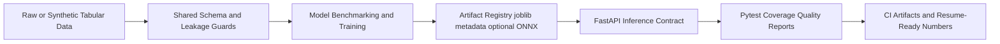

# 🚀 ML Platform Monorepo: Sales Forecasting + California Housing Template

## Resume Pitch
I built a production-style ML platform in a single monorepo to solve a real delivery problem: turn tabular business data into reliable predictions, reproducible experiments, and API-ready services without rewriting infrastructure for each dataset.

This repo demonstrates one shared platform (`ml_core`) powering two use-cases:

- `sales_forecasting_regression` as the flagship production path
- `california_housing_template` as a reference implementation with the same contracts

## 🧠 What Problem Was Solved?
Teams usually build one-off ML scripts per dataset. That creates repeated code, inconsistent schemas, and hard-to-defend model claims.

This project solves that with:

- shared train/inference schema contracts
- reusable artifact registry and serving layer
- unified testing and quality reporting pipeline
- reproducible metrics stored as files

## Architecture


## 🛠️ Technologies I Tried, and Why I Chose This Stack

### Data and Processing
- Tried: pandas-first path and optional Polars + DuckDB path.
- Chosen: pandas for core model pipeline portability, Polars + DuckDB for scalable data-layer operations in Sales.
- Why: predictable CI behavior plus modern analytical tooling.

### Modeling
- Tried: `LinearRegression`, `RandomForestRegressor`, `GradientBoostingRegressor`.
- Chosen: candidate benchmarking with shared trainer and metric-based winner selection.
- Why: transparent baseline-to-ensemble comparison and defensible model choice.

### Serving
- Tried: separate APIs per project.
- Chosen: shared FastAPI app factory in `ml_core.serving` with dynamic request models from `FeatureSchema`.
- Why: no contract drift between projects and less duplicate code.

### MLOps and Validation
- Tried: plain test execution only.
- Chosen: pytest + coverage + junit + structured quality JSON reports.
- Why: every README claim is backed by generated artifacts.

## 📈 Metrics (Real, Saved, Reproducible)
Source: `reports/quality/quality_report.json` generated at `2026-02-15T11:39:05.498607+00:00`.

### Test and Coverage
- Tests passed: `27/27`
- Coverage: `87.22%` (`614/704` lines)
- Test duration: `12.465s`

### Sales Forecasting Regression
- Best model: `GradientBoostingRegressor`
- RMSE: `262.9941`
- MAE: `202.8622`
- R2: `0.9907`
- Sample prediction: `3695.3860`
- Latency p95: `1.0094 ms`
- Calibration error: `42.9567`
- PSI on `PRICEEACH`: `0.0350`

### California Housing Template
- Best model: `LinearRegression`
- RMSE: `0.2251`
- MAE: `0.1765`
- R2: `0.9597`
- Sample prediction: `194.1078`
- Latency p95: `0.4794 ms`
- Calibration error: `0.0112`
- PSI on `MedInc`: `0.2444`

## ⚠️ Challenges and How I Solved Them
- Challenge: train/serve schema drift.
- Solution: centralized `FeatureSchema` and shared request-model generation.

- Challenge: leakage risk when features evolve.
- Solution: explicit leakage guards and strict schema validation before split/train.

- Challenge: local environment inconsistency.
- Solution: Docker-based quality execution and persisted reports for deterministic validation.

- Challenge: duplicated infrastructure across projects.
- Solution: moved reusable logic into `libs/ml_core`; project folders keep only domain-specific behavior.

- Challenge: weak resume claims without evidence.
- Solution: generated and stored coverage, junit logs, train metrics, latency metrics, and consolidated quality reports.

## ✅ How to Run
```bash
python -m venv .venv
source .venv/bin/activate
pip install -e .[dev]

sales-train
california-train

uvicorn sales_forecasting_regression.api:app --reload --port 8000
uvicorn california_housing_template.api:app --reload --port 8001
```

## Quality Evidence Pipeline
```bash
python scripts/quality/generate_quality_report.py
```

Generated files:

- `reports/quality/quality_report.json`
- `reports/quality/coverage.json`
- `reports/quality/pytest.junit.xml`
- `reports/quality/pytest.log`
- `reports/quality/sales/train_metrics.json`
- `reports/quality/sales/quality_metrics.json`
- `reports/quality/california/train_metrics.json`
- `reports/quality/california/quality_metrics.json`
- `reports/quality/README_SNAPSHOT.md`

## Docker
```bash
docker compose up --build
```

## License
```text
MIT License

Copyright (c) 2026 Mohammad Eslamnia
...
```
