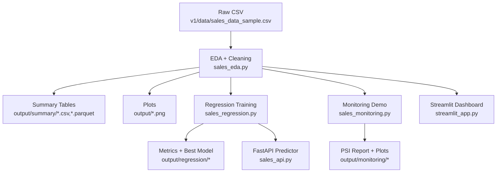

# 📊 Sales Data EDA & Regression (v1) — Config‑Driven Analytics → Baseline ML → Monitoring → API/Dashboard

**v1** is the “clean prototype” version of the project: no notebooks, no hand-clicking, no hidden state.  
It turns one Kaggle sales CSV into a **repeatable EDA + regression pipeline**, plus a lightweight monitoring demo, a Streamlit dashboard, and a FastAPI prediction endpoint.

> **Interview story (v1):**  
> *“I built a config-driven analytics pipeline in pure Python modules: deterministic cleaning + outlier handling, reproducible EDA outputs (tables + plots), baseline regression with proper preprocessing, a drift/monitoring demo (PSI), and a thin serving layer (Streamlit + FastAPI).”*

---

## ✅ What v1 proves (skills you can defend in an interview)

### Data analytics engineering (reproducible EDA)

- YAML **config-driven execution** (paths, cleaning rules, outlier parameters, plots)
- Deterministic cleaning + feature extraction from `ORDERDATE`
- Exported analytics artifacts (CSV + Parquet) and saved plots (PNG)

### ML engineering fundamentals

- Proper train/test split, preprocessing, encoding
- Feature engineering without target leakage
- Model benchmarking (Linear vs RF vs Gradient Boosting), plus a tuning example

### “Production-thinking” extras (even in v1)

- Basic drift/monitoring concept (PSI)
- Simple Streamlit dashboard (data → insights UI)
- Simple FastAPI prediction service (model → HTTP)

### Code quality

- Package-style structure with `pyproject.toml`
- Small tests to protect feature engineering + regression pipeline

---

## 🔗 Dataset

This project uses Kaggle **Sample Sales Data**:

- File: `sales_data_sample.csv`
- Kaggle page: <https://www.kaggle.com/datasets/kyanyoga/sample-sales-data>

⚠️ **License note**: the CSV is **not committed** to this repository.  
Download it manually and put it here:

```text
v1/data/sales_data_sample.csv
```

---

## 🎯 Problem statement (what v1 solves)

Given a messy sales CSV export, build a pipeline that can:

1. **Clean & standardize** the dataset (missing values + messy dates)
2. Produce **repeatable EDA** outputs (summary tables + grouped insights + plots)
3. Train baseline **regression models** to predict `SALES` at order-line level
4. Demonstrate a lightweight **monitoring idea** (distribution shift / PSI)
5. Expose results via **dashboard + API**

This is exactly the kind of end-to-end workflow you’ll see in real analytics/ML teams—just scaled down to a portfolio-sized repo.

---

## 🧱 Architecture (v1 pipeline)



---

## 🧾 Config-driven design (why this matters)

The entire v1 flow is controlled by `config.yaml`:

- dataset path
- numeric columns
- cleaning rules:
  - columns to drop
  - columns to fill with `"Unknown"`
  - postal code handling
- outlier detection parameters (IQR factor)
- which plots to generate (hist/scatter/box)

**Why this choice (interview answer):**

- config-driven pipelines are easier to **re-run**, **compare**, **refactor**, and **extend** than scripts with hardcoded paths/columns.
- this reduces “works on my machine” problems and makes the project look like real engineering.

---

## 📦 Setup

### 1) Create venv and install

From repo root (where `pyproject.toml` is):

```bash
python -m venv .venv
source .venv/bin/activate  # Windows: .venv\Scripts\activate
pip install -e .
```

Minimal v1 dependencies (rough list):

```bash
pip install pandas numpy matplotlib seaborn pyyaml scikit-learn joblib pyarrow streamlit fastapi uvicorn pytest
```

### 2) Place dataset

```text
v1/data/sales_data_sample.csv
```

---

## ▶️ Run v1 (EDA → Regression → Monitoring)

### 1) Run EDA

```bash
cd v1
python sales_eda.py
```

Produces:

- Summary tables: `output/summary/*.csv` and `*.parquet`
- Plots: `output/*.png`

### 2) Train regression models

```bash
python sales_regression.py
```

Produces:

- Metrics tables: `output/regression/advanced_metrics.{csv,parquet}`
- Best model artifact: `output/regression/sales_regression_best_*.joblib`

### 3) Run monitoring / drift demo

```bash
python sales_monitoring.py
```

Produces:

- PSI JSON report: `output/monitoring/psi_sales_*.json`
- Comparison plot: `output/monitoring/sales_*.png`

---

## 🧹 Data cleaning logic (v1)

### Missing values (deterministic rules)

- Drop `ADDRESSLINE2` (mostly missing; low analytics value)
- Fill `STATE` and `TERRITORY` with `"Unknown"`
- Cast `POSTALCODE` to string and fill missing with `"Unknown"`

### Date parsing

- Parse `ORDERDATE`
- Create derived features:
  - `YEAR`
  - `MONTH`

### Outliers (IQR rule)

For each numeric column in `numeric_columns` (e.g., `QUANTITYORDERED`, `PRICEEACH`, `SALES`, `MSRP`):

1. compute Q1, Q3, IQR
2. bounds: `Q1 - factor*IQR` and `Q3 + factor*IQR`
3. remove rows outside bounds (sequentially per column)

**Why IQR (interview answer):**

- simple, explainable, deterministic, and good for demo-scale pipelines  
- easy to tune via `iqr_factor` in config

---

## 📊 EDA outputs (what you can talk about)

### Summary tables

- descriptive stats (numeric columns)
- grouped insights:
  - sales by `PRODUCTLINE`
  - top countries by total sales
  - sales by year

Exports in both formats:

- CSV for readability
- Parquet for speed and downstream use

### Plots

- histograms (`SALES`, `QUANTITYORDERED`)
- scatter plots (`QUANTITYORDERED` vs `SALES`, `PRICEEACH` vs `SALES`)
- boxplots (sales by product line, quantity by deal size)

**Interview angle:** you can quickly explain distribution, skew, outliers, and segment differences.

---

## 🤖 Regression on `SALES` (v1)

### Feature engineering (no leakage)

- date features:
  - `YEAR`, `MONTH`, `QUARTER`, `SEASON`
- derived numeric features:
  - `PRICE_TO_MSRP_RATIO = PRICEEACH / MSRP`
  - `LINE_TOTAL_APPROX = QUANTITYORDERED * PRICEEACH`
- categorical features:
  - `PRODUCTLINE`, `DEALSIZE`, `COUNTRY`, `SEASON`

### Preprocessing

- numeric → `StandardScaler`
- categorical → `OneHotEncoder(handle_unknown="ignore")`
- implemented with `ColumnTransformer`

### Models benchmarked

1. Linear Regression (baseline)
2. RandomForest (baseline)
3. GradientBoosting (baseline)
4. RandomForest tuned (RandomizedSearchCV)

**Why these models (interview answer):**

- Linear regression sets a sanity baseline
- RandomForest/GB capture non-linear interactions common in tabular business data
- tuning example shows you understand the tradeoff between performance and complexity

### Metrics tracked

- MSE
- RMSE (main)
- MAE
- R²

Example results from a real run on `sample_sales`:

| Model                     | MSE        | RMSE    | MAE     | R²    |
|--------------------------|------------|---------|---------|-------|
| LinearRegression_baseline | 233263.80  | 482.97  | 340.78  | 0.903 |
| RandomForest_baseline     | 134122.17  | 366.23  | 188.66  | 0.944 |
| GradientBoosting_baseline | 126395.65  | 355.52  | 201.49  | 0.947 |
| RandomForest_tuned        | 137114.12  | 370.29  | 190.44  | 0.943 |

**Key takeaway:** On this dataset, a standard GradientBoostingRegressor won without heavy tuning—realistic and defensible.

---

## 📉 Monitoring / drift demo (PSI)

`sales_monitoring.py` demonstrates drift detection thinking:

- split data into two periods (earliest vs latest year; fallback to first vs second half)
- compute **Population Stability Index (PSI)** for `SALES`
- save JSON + comparison histogram

**Why PSI (interview answer):**

- it’s a simple, explainable monitoring metric that demonstrates awareness of model decay risk over time

---

## 📺 Streamlit dashboard (v1)

Run:

```bash
python -m streamlit run streamlit_app.py
```

Shows:

- quick summary stats
- top product lines / countries
- basic charts and filters

**Interview angle:** demonstrates you can deliver insights to non-technical users without building a full frontend.

---

## 🌐 FastAPI prediction service (v1)

Train first:

```bash
python sales_regression.py
```

Then run API:

```bash
uvicorn sales_api:app --reload
```

- Swagger docs: `http://127.0.0.1:8000/docs`
- `POST /predict` expects order-line features and returns predicted `SALES`

**Interview angle:** demonstrates you can move from “model file” to “serving endpoint”.

---

## ✅ Tests (v1)

Run:

```bash
python -m pytest
```

Included tests cover:

- feature engineering outputs exist and have expected types
- regression pipeline produces non-empty metrics and valid RMSE values

**Why this matters:** small tests make refactors safe and show you treat ML code like software.

---

## 🛠️ Common issues & how v1 handles them (interview-ready)

- **Missing values**: explicit rules; avoids silent drops
- **Outliers**: deterministic IQR removal; configurable aggressiveness
- **Categoricals**: OneHotEncoder with `handle_unknown="ignore"` to prevent inference crashes
- **Reproducibility**: config-driven + saved artifacts (tables/plots/models/metrics)

---

## 🔜 What v1 deliberately does NOT do (and why v2 exists)

v1 focuses on clarity and fundamentals. It intentionally avoids “big stack” MLOps complexity.

If asked what you improved in v2:

- Parquet + DuckDB layer
- MLflow experiment tracking
- SHAP + ONNX export
- stronger packaging and schema discipline
- time-series risk module

---

## 📜 License

MIT License. See `LICENSE`.
